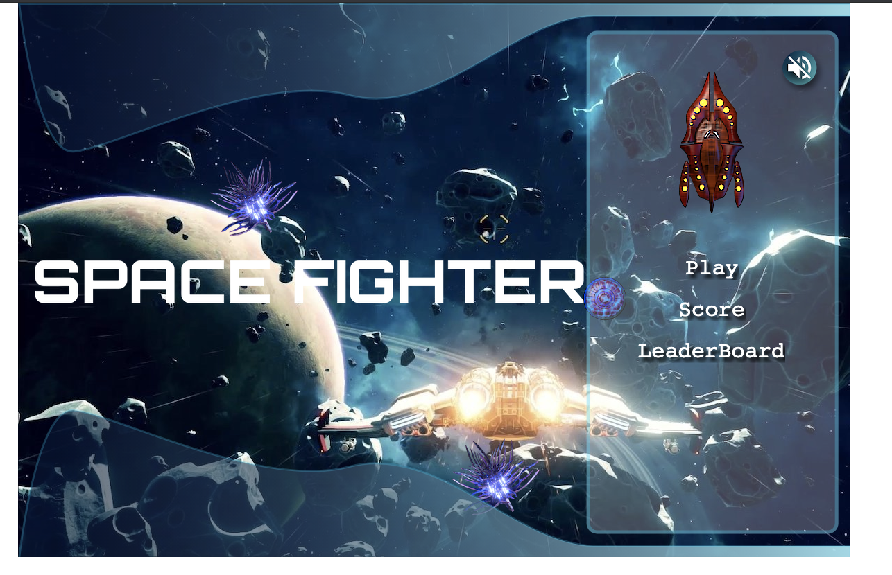
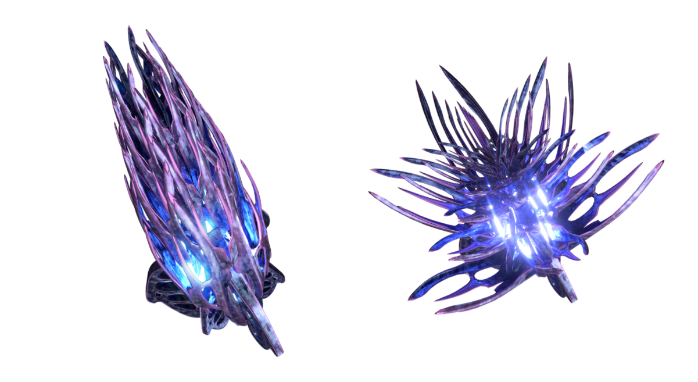
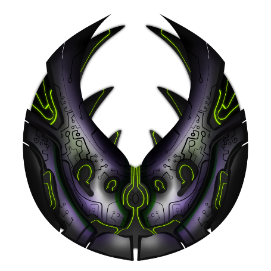

# Space-Fighter 🚀

> This game is a capstone project for Javascript module. I have used phaser 3 framework to build this. In this game user can perform following actions:

- User can play this game with tap on "Play button" on the menu scene.
- User can see the current and best score with tap on "Score button" on the menu scene.
- User can see leaderboard with tap on "Leaderboard button" on the menu scene.
- A mute button is provided on the top right corner of the menu scene to mute the music.
- A return button is provided on leaderboard and score scene to take you back to menu scene.

### Game Specification

- Player is located on the bottom center of the canvas.
- Player can move right and left with keyboard arrow keys.
- Player can fire the missile with space button on keyboard.
- Name input form will only appear at the end of a game.
- On the top left corner of the play scene, you can see your score and best score.
- There are 3 different types of enemies(UFO, StarAlien and MainEnemy) in the game.
- Shooting UFO and StarAlien will get you 5 points each.
- Main enemy will die with 3 shoots and will get you 10 points.
- There are enemies which you will not be able to shoot, they will be same type of an enemy and you can find them close to each other. It is better to avoid them otherwise game will end if they collide with player.
- If any enemy collide with player, game will end.
- After end of the game, you will be redirected to menu scene, where you will see a name input form.
- You need to enter your name and submit the form to post your score on leaderboard.
- If you don't want to post your score then tap any button on the menu scene, the form will disappear.

> Menu Scene

- 

> UFO Enemy

- 

> Star Alien Enemy

- 

> Main Enemy

- 

## Built With

- Javascript
- Phaser 3
- Jest
- axios
- Jquery
- Webpack
- ESLint
- Stylelint

## Live Demo

[Space-Fighter](https://space-fighter-mauve.vercel.app/)

### Prerequisites

Node

**Setup**

- Clone this repository with: "git clone git@github.com:Amita-Roy/Space-Fighter.git" using your terminal or command line.

- Change to the project directory by entering cd 'space-fighter' in the terminal

- Next run npm install to install the necessary dependencies

- Finally run the 'npm run build' and 'npm start' to start the application

- 'npm run dev' is for building the project in development mode

- 'npm run build' is for building the project in production mode

- 'npm start' is for starting the server in development mode

- 'npm run watch' to run the tests

### Usage

Start server with:

```
    npm start
```

To run the tests:

```
    npm run watch
```

## Author

👤 **Amita Roy**

- Github: [@Amita](https://github.com/Amita-Roy)
- Twitter: [@Amita](https://twitter.com/AmitaRoy14)
- Linkedin: [@Amita](https://www.linkedin.com/in/amita-roy-3b823b68/)

## 🤝 Contributing

Contributions, issues and feature requests are welcome!

Feel free to check the [issues page](issues/).

## Show your support

Give a ⭐️ if you like this project!

## 📝 License
